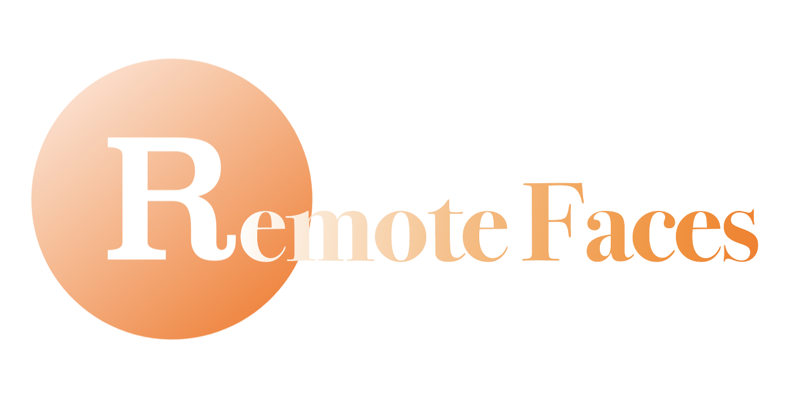
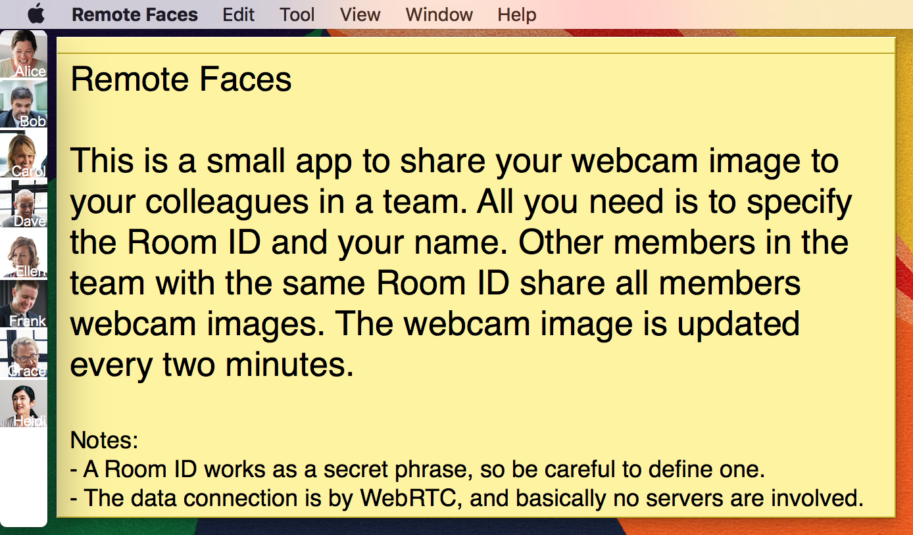

# Remote Faces

A small app to share webcam still images periodically

## Motivation

Nowadays, quite a few people work from home.
Tools for instant messaging and video conferencing
allow the remote working style.
Those tools are useful and mandatory, but it turns out that
it would also be nice to have another tool for working from home.

The desired tool is something we run all the time passively,
and we feel connected with others even working from home.
If you work at office, you would see other people from
your desk or maybe at least in the same floor.

"Remote Faces" is a small app to share a webcam image;
not a video, but a still image.
The image will be updated only periodically.
The size of the image is small enough to keep your privacy to some extent.
It doesn't involve a server to transfer image data,
but it's done in a peer-to-peer manner.

## Goal

The goal of this project is to provide a tool for
people working from home.
The tool is something to keep running and used passively.
In a sense, it's a tool that is complementary to
more active tools like email, messaging, phone and video calls.
That doesn't mean the scope of this project doesn't include video calls.
There might be a "passive" way of using video calls;
Not a scheduled video call, but a video call for small talk.

Although not a primary goal, as we take privacy seriously,
our technology focus is for peer-to-peer network.

## How to use

Just visit the following links and select "Latest Version."
Google Chrome on PC is recommended.
It may work on other browsers including some on mobile.

[Select Remote Faces Versions](https://dai-shi.github.io/remote-faces/tools/select.html)

To create a new room, click the button and the app starts immediately.
Copy the URL and share it with your colleagues.
It will take your face image with webcam every two minuites.
At first, you will only see your face,
but once your colleagues enter the room,
face images are broacasted within the room.
Note this app is based on peer-to-peer technology,
and the images are only transferred in the participants of the room.

You may specify your name in the text field.
If you type a message in the text field right to your face,
it will be shared along with your face image
(so, it updates once every two minuites).

If you are trying this app for the first time,
you can open the app in multiple tabs in Chrome.
You can open it as many as you want and simulate
the app behavior with many participants.

If you have a question, don't hesitate to
[open an issue](https://github.com/dai-shi/remote-faces/issues/new/choose)
for it.

## How to contribute

This is an ongoing project and your contribution is important.
The web app is built with [React](https://reactjs.org) and
[PeerJS](https://peerjs.com).

We welcome your contribution at any level; from coding,
issue reporting, bug fixing, discussing features, documentation
and to promotion!

For more information, check out [CONTRIBUTING.md](./CONTRIBUTING.md).

## Screenshots

<!--
## Downloads

<https://github.com/dai-shi/remote-faces/releases>
-->

## Blogs

- [Remote Faces: Share webcam still images with PeerJS/WebRTC](https://medium.com/@dai_shi/remote-faces-share-webcam-still-images-with-peerjs-webrtc-a7ed5fe11e49)
